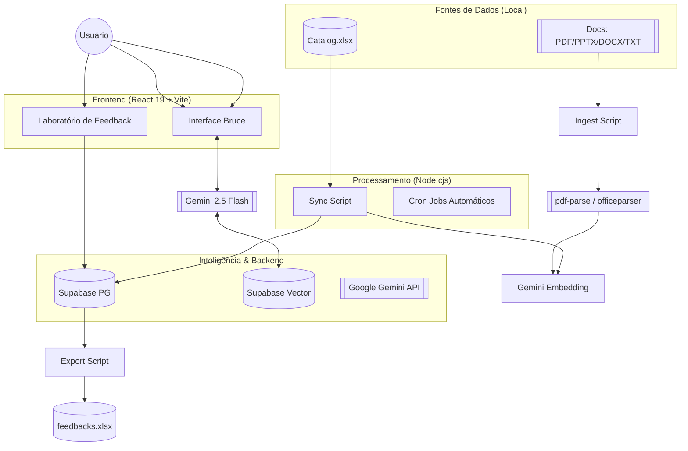
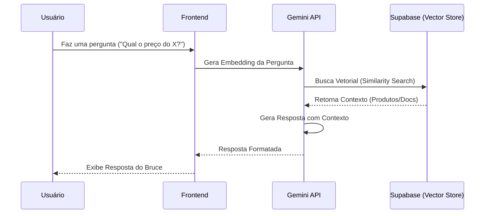

# Arquitetura Tecnica - Trillia Platform & Bruce Assistente

Este documento detalha o ecossistema tecnológico, as escolhas de engenharia e os modelos de IA que compõem a plataforma Trillia.

## Visual de Arquitetura

### Fluxo Geral do Sistema

### Fluxo de RAG (Busca Inteligente)

---

## 1. Engenharia de Software (Frontend & Core)

A plataforma foi construída seguindo princípios de **Modern Web Performance** e **Visual Experience (UX/UI)**.

- **Framework**: [React 19](https://react.dev/) (Vite) para uma renderização ultrarrápida e modular.
- **Linguagem**: TypeScript para garantir tipagem forte e segurança de código.
- **Estilização**: Sistema híbrido utilizando **Vanilla CSS + Modern Tokens**. Foco em **Glassmorphism**, contrastes profundos e estética Premium.
- **Animações**: [Framer Motion (motion/react)](https://www.framer.com/motion/) para micro-interações fluidas e transições de estado (Modais, Listas, Cards).
- **Icons**: [Lucide React](https://lucide.dev/) para uma biblioteca vetorial consistente.

---

## 2. Inteligência Artificial Generativa (Bruce Assistente)

O "cérebro" da plataforma utiliza o estado da arte em Large Language Models (LLMs) do Google.

- **Modelo de Chat**: **Gemini 2.5 Flash**. Escolhido pelo equilíbrio perfeito entre baixa latência e raciocínio complexo.
- **Estrutura de Custos (Gemini 2.5 Flash)**:
    - **Input**: ~$0.075 por 1 milhão de tokens.
    - **Output**: ~$0.30 por 1 milhão de tokens.
    - **Contexto**: Suporta até 1M+ de tokens, ideal para RAG extensivo.
    - **Eficiência**: Otimizado para respostas rápidas (<1.5s) com alta precisão.
- **Capacidades**:
    - Reconhecimento de intenção (Intent Recognition).
    - Formatação de respostas em Markdown.
    - Personalidade amigável e técnica ("Assistente de Curadoria").
- **Embeddings**: Modelo `gemini-embedding-001` para transformar textos técnicos da planilha e de documentos (PDF, PPTX, TXT) em vetores matemáticos de alta dimensão.
    - **Custo**: ~$0.15 por 1 milhão de tokens de input (sem custo de output).
- **Referência de Preços**:
    - *Valores documentados em Março de 2026.*
    - Para atualizações em tempo real, consulte: [Google AI Pricing](https://ai.google.dev/pricing)

---

## 3. Estrategia de Dados & RAG

Utilizamos **RAG (Retrieval-Augmented Generation)** para garantir que o Bruce nunca invente informações (alucinação).

- **Busca Vetorial**: Integra dados da planilha de produtos e de documentos externos.
- **Formatos Suportados**: Além do Excel, o Bruce "lê" arquivos em massa da pasta `data/docs`. Utilizamos nativamente `pdf-parse` e `officeparser` para extrair buffers de texto de `.pdf`, `.pptx`, `.docx` e `.txt`.
- **Processo RAG**:
    1. O usuário faz uma pergunta.
    2. O sistema gera um embedding da pergunta.
    3. Fazemos uma busca vetorial no Supabase para encontrar os produtos ou documentos mais relevantes.
    4. Enviamos esse contexto para o Gemini gerar a resposta precisa.

---

## 4. Banco de Dados e Backend (Supabase)

Utilizamos o **Supabase** como plataforma de backend as a service, provendo:

- **Relacional**: PostgreSQL para armazenar os produtos estruturados e o log de feedbacks.
- **Vetorial**: Extensão `pgvector` para armazenar os embeddings do catálogo e de documentos da RAG.
- **Feedback Loop**: Tabela `feedbacks` projetada para escalabilidade. O frontend insere os relatórios diretamente na nuvem (evitando corrupção de arquivos lidos simultaneamente) e os administradores consomem essa tabela utilizando o script Node.js offline (`export_feedbacks.cjs`) que converte os registros em uma planilha `feedbacks_trillia.xlsx` auditável.

---

## 5. Ecossistema de Integracao (Single Source of Truth)

O projeto inova ao utilizar o **Excel como fonte primária de verdade**, facilitando a gestão por pessoas não-técnicas.

- **Sincronização**: Scripts customizados em Node.js (`sync_catalog.js`) que:
    - **Wipe Sync**: Limpam todos os produtos e vetores existentes para garantir integridade.
    - **Parsing**: Processam 18 colunas do Excel (`xlsx`), incluindo metadados profundos.
    - **Embedding**: Geram vetores atômicos para cada produto usando Google AI.
    - **Atomic Update**: Atualizam o Supabase (Relacional + Vector) em um único fluxo.
- **Colunas da Planilha**: `sku`, `name`, `description`, `category`, `price`, `tag`, `owner`, `squad`, `revenue`, `bu`, `mercado`, `pricing`, `enxoval_link`, `problem`, `use_cases`, `technical_solution`, `tech_stack`.
- **Cron Jobs**: Sistema de sincronização agendada para manter o Bruce sempre atualizado com o `catalog.xlsx`.

---

## 6. Stack Tecnologica (Ferramentas)

| Camada | Tecnologia |
| :--- | :--- |
| **Frontend** | React, Vite, Framer Motion, Lucide |
| **IA Chat** | Google Gemini 2.5 Flash |
| **IA Vector** | Google Gemini Embeddings |
| **Database** | Supabase (PostgreSQL + pgvector) |
| **Scripts** | Node.js (CommonJS & ESM) |
| **Parsers** | `pdf-parse` (PDF) & `officeparser` (PPTX/DOCX) |
| **Data Format** | Excel (.xlsx), CSV, JSON, TXT |
| **Deployment** | Git / GitHub Versioning |

---
**Arquitetura desenhada para: Escalabilidade, Precisao de Dados e Experiencia de Usuario de Elite.**
