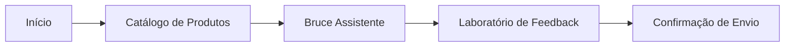

# Trillia Platform - Bruce Assistente

Bem-vindo ao repositório do Trillia Platform, integrando o **Bruce Assistente** com inteligência artificial e um ecossistema de dados automatizado.

## Jornada do Usuário

A plataforma Trillia focada em guiar o colaborador através de horizontes de inovação, desde as soluções amadurecidas até as apostas de futuro.



### Telas Principais

- **Início**: Portal de entrada com visão consolidada da proposta de valor da plataforma e acesso rápido aos módulos.
- **Catálogo de Produtos**: Central de visualização do portfólio dividido por **Horizontes (H1, H2 e H3)**, facilitando a navegação entre produtos atuais e inovações futuras.
- **Bruce Assistente**: Interface de chat inteligente que fornece suporte técnico e comercial baseado em dados reais de produtos e manuais.
- **Laboratório de Feedback**: Formulário especializado para capturar insights, reportar bugs ou sugerir novas funcionalidades em fluxos guiados.

---

## Configuracao e Execucao

Para rodar o projeto localmente em qualquer máquina:

1.  **Instale as dependências:**
    ```bash
    npm install
    ```
2.  **Configure as Variáveis de Ambiente:**
    Crie um arquivo `.env` na raiz do projeto (use o `.env.example` como base) com as seguintes chaves:
    *   `VITE_GEMINI_API_KEY`: Sua chave de API do Google Gemini.
    *   `VITE_SUPABASE_URL`: A URL do seu projeto Supabase.
    *   `VITE_SUPABASE_ANON_KEY`: A chave anon/public do seu Supabase.

3.  **Inicie o Servidor de Desenvolvimento:**
    ```bash
    npm run dev
    ```

---

## Gestao de Dados e Conhecimento

O Bruce Assistente se alimenta de duas fontes principais: Catálogo (Produtos) e Documentos (Conhecimento Adicional).

### 1. Cadastro de Produtos (Excel - "Single Source of Truth")
*   **Onde**: `data/catalog.xlsx`
*   **Ação**: Preencha a planilha com as colunas de dados essenciais (SKU, Nome, Descrição, etc.), garantindo que as colunas críticas como `enxoval_link` e `owner_email` estejam preenchidas ou mapeadas pelo script.
*   **Sincronizar**: Rode `node scripts/sync_all.js`. 
    *   Este comando central realiza um **Wipe Sync**: limpa o banco de produtos e documentos antigos para evitar duplicações.
    *   Sincroniza os 35 produtos do catálogo.
    *   Indexa automaticamente o conteúdo estático do site (ex: Fases da Metodologia do `App.tsx`) para o contexto do RAG.

### 2. Indexação de Documentos Extras (PDF, PPTX, DOCX, TXT)
*   **Onde**: Pasta `data/docs/`
*   **Ação**: Jogue aqui apresentações ou manuais técnicos complementares.
*   **Motor de Extração**: O script conta com `pdf-parse` para leitura profunda de PDFs e `officeparser` para abrir os bytes de PPTX/DOCX nativamente no Node.js.
*   **Sincronizar**: Rode `node --env-file=.env scripts/ingest_docs.js`.
*   **Automação (Cron)**: O sistema possui um cron que verifica novos arquivos a cada **1 minuto**. Para ativar:
    ```bash
    node scripts/cron_rag.cjs
    ```

---

## Requisitos de Banco de Dados (Supabase)

Para o sistema funcionar (Feedbacks e Bruce Assistente), você precisa configurar o banco:

1.  Acesse o **SQL Editor** no seu painel do Supabase.
2.  Copie e cole o conteúdo do arquivo [supabase/setup.sql](supabase/setup.sql).
3.  Execute o script. Isso criará as tabelas `products`, `documents` e `feedbacks`, além de habilitar a busca vetorial.

---

## 🚦 Riscos Mapeados (Lições do Rollback)

Durante o desenvolvimento da UI dos cartões de produto, enfrentamos quebras estruturais que exigiram um **rollback** do código fonte (`App.tsx`). Para evitar futuras regressões, os seguintes riscos estão mapeados:

1.  **Destruição de Estado (React Hooks)**: Alterações massivas de refatoração no `App.tsx` têm alto risco de quebrar regras de Hooks ou apagar variáveis de estado cruciais (como `messages` do Bruce ou estado do modal `selectedProduct`).
2.  **Sincronização Divergente**: Atualizar a UI para exibir dados novos (ex: `owner_email` ou `enxoval_link`) sem primeiro garantir que o pipeline de sincronização (`sync_all.js` e a tabela do Supabase) os suporte, levará a campos em branco e quebra de navegação.
3.  **Wipe Constraints no RAG**: Alterar a lógica de deleção no `sync_all.js` (como remover o filtro de IDs fantasmas) pode acidentalmente deletar históricos de chat ou documentos ingeridos manualmente via `ingest_docs.js`. O Wipe Sync deve sempre focar **estritamente em registros gerados por máquina** (`Excel_Catalog` ou `Site_Content`).
4.  **Estilização "Frankenstein"**: Misturar classes Tailwind novas sem checar os globals e breakpoints preexistentes pode causar o fenômeno de modais que não fecham ou z-indexes sobrepostos que ocultam o botão do Bruce. Teste de regressão visual no desktop e mobile é obrigatório.

---
**Status Final**: **Tudo Operacional e Sincronizado! (v1.1 - Pos-Rollback Integrado)**
