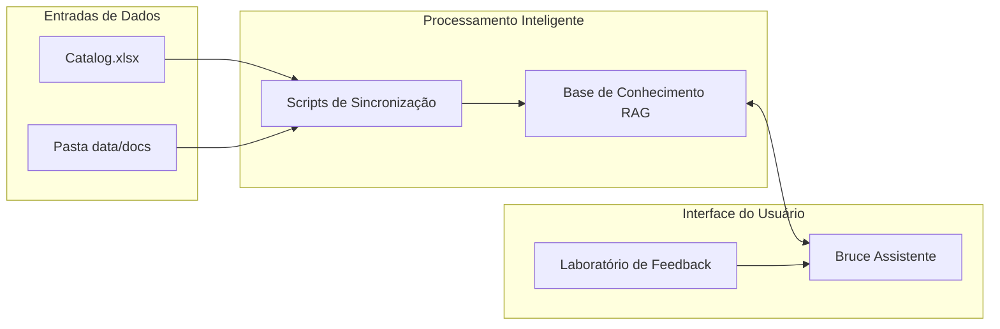

# Trillia Platform - Bruce Assistente

Bem-vindo ao repositório do Trillia Platform, integrando o **Bruce Assistente** com inteligência artificial e um ecossistema de dados automatizado.

## Visão Geral do Sistema



---

## Configuracao e Execucao

Para rodar o projeto localmente em qualquer máquina:

1.  **Instale as dependências:**
    ```bash
    npm install
    ```
2.  **Configure as Variáveis de Ambiente:**
    Crie um arquivo `.env` na raiz do projeto (use o `.env.example` como base) com as seguintes chaves:
    *   `VITE_GEMINI_API_KEY`: Sua chave de API do Google Gemini.
    *   `VITE_SUPABASE_URL`: A URL do seu projeto Supabase.
    *   `VITE_SUPABASE_ANON_KEY`: A chave anon/public do seu Supabase.

3.  **Inicie o Servidor de Desenvolvimento:**
    ```bash
    npm run dev
    ```

---

## Gestao de Dados e Conhecimento

O Bruce Assistente se alimenta de duas fontes principais: Catálogo (Produtos) e Documentos (Conhecimento Adicional).

### 1. Cadastro de Produtos (Excel)
*   **Onde**: `data/catalog.xlsx`
*   **Ação**: Preencha a planilha com SKUs, Nomes e Preços.
*   **Sincronizar**: Rode `node scripts/sync_now.cjs`. Isso atualiza o catálogo no site e no cérebro do Bruce.

### 2. Indexação de Documentos (PDF, PPTX, TXT)
*   **Onde**: Pasta `data/docs/`
*   **Ação**: Jogue aqui apresentações, PDFs técnicos ou manuais.
*   **Sincronizar Manual**: Rode `node scripts/ingest_rag.cjs`.
*   **Automação (Cron)**: O sistema possui um cron que verifica novos arquivos a cada **1 minuto**. Para ativar:
    ```bash
    node scripts/cron_rag.cjs
    ```

---

## Bruce Assistente

O assistente utiliza o modelo **Gemini 2.5 Flash** e técnica de **RAG**. Ele combina as informações da sua planilha de produtos com os documentos extras da pasta `data/docs/` para dar respostas completas e precisão cirúrgica.

---

## Requisitos de Banco de Dados (Supabase)

Para o sistema funcionar (Feedbacks e Bruce Assistente), você precisa configurar o banco:

1.  Acesse o **SQL Editor** no seu painel do Supabase.
2.  Copie e cole o conteúdo do arquivo [supabase/setup.sql](supabase/setup.sql).
3.  Execute o script. Isso criará as tabelas `products`, `documents` e `feedbacks`, além de habilitar a busca vetorial.

---
**Status Final**: **Tudo Operacional e Sincronizado!**
