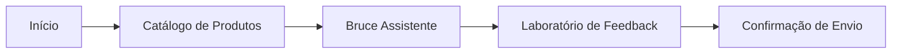

# Trillia Platform - Bruce Assistente

Bem-vindo ao repositório do Trillia Platform, integrando o **Bruce Assistente** com inteligência artificial e um ecossistema de dados automatizado.

## Jornada do Usuário

A plataforma Trillia focada em guiar o colaborador através de horizontes de inovação, desde as soluções amadurecidas até as apostas de futuro.



### Telas Principais

- **Início**: Portal de entrada com visão consolidada da proposta de valor da plataforma e acesso rápido aos módulos.
- **Catálogo de Produtos**: Central de visualização do portfólio dividido por **Horizontes (H1, H2 e H3)**, facilitando a navegação entre produtos atuais e inovações futuras.
- **Bruce Assistente**: Interface de chat inteligente que fornece suporte técnico e comercial baseado em dados reais de produtos e manuais.
- **Laboratório de Feedback**: Formulário especializado para capturar insights, reportar bugs ou sugerir novas funcionalidades em fluxos guiados.

---

## Configuracao e Execucao

Para rodar o projeto localmente em qualquer máquina:

1.  **Instale as dependências:**
    ```bash
    npm install
    ```
2.  **Configure as Variáveis de Ambiente:**
    Crie um arquivo `.env` na raiz do projeto (use o `.env.example` como base) com as seguintes chaves:
    *   `VITE_GEMINI_API_KEY`: Sua chave de API do Google Gemini.
    *   `VITE_SUPABASE_URL`: A URL do seu projeto Supabase.
    *   `VITE_SUPABASE_ANON_KEY`: A chave anon/public do seu Supabase.

3.  **Inicie o Servidor de Desenvolvimento:**
    ```bash
    npm run dev
    ```

---

## Gestao de Dados e Conhecimento

O Bruce Assistente se alimenta de duas fontes principais: Catálogo (Produtos) e Documentos (Conhecimento Adicional).

### 1. Cadastro de Produtos (Excel - "Single Source of Truth")
*   **Onde**: `data/catalog.xlsx`
*   **Ação**: Preencha a planilha com as 18 colunas de dados (SKU, Nome, Descrição, Deep Dives, etc).
*   **Sincronizar**: Rode `node scripts/sync_catalog.js`. 
    *   Este comando realiza um **Wipe Sync**: limpa o banco e re-insere tudo, garantindo 100% de paridade.
    *   Gera automaticamente os **embeddings** para o Bruce Assistente.

### 2. Indexação de Documentos Extras (PDF, PPTX)
*   **Onde**: Pasta `data/docs/`
*   **Ação**: Jogue aqui apresentações ou manuais técnicos complementares.
*   **Sincronizar**: Rode `node scripts/ingest_rag.cjs`.
*   **Automação (Cron)**: O sistema possui um cron que verifica novos arquivos a cada **1 minuto**. Para ativar:
    ```bash
    node scripts/cron_rag.cjs
    ```

---

## Requisitos de Banco de Dados (Supabase)

Para o sistema funcionar (Feedbacks e Bruce Assistente), você precisa configurar o banco:

1.  Acesse o **SQL Editor** no seu painel do Supabase.
2.  Copie e cole o conteúdo do arquivo [supabase/setup.sql](supabase/setup.sql).
3.  Execute o script. Isso criará as tabelas `products`, `documents` e `feedbacks`, além de habilitar a busca vetorial.

---
**Status Final**: **Tudo Operacional e Sincronizado!**
